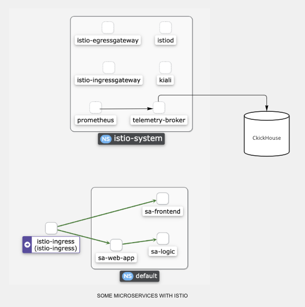

# Экспорт метрик из Istio в ClickHouse

1. Кроном забираем метрики и метаданные в соответствии с Prometheus-совместимым протоколом.
2. Загружаем метрики батчами (батчи - todo) в ClickHouse. Метаданные пока храним только в памяти.
3. (todo) Напилить консольный клиент и/или настройку параметров экспорта простыми yaml-ами (пример от sensu https://docs.sensu.io/sensu-enterprise/latest/integrations/influxdb/)



## Структура таблиц в ClickHouse
```
CREATE DATABASE metrics


CREATE TABLE metrics.metrics (
    _id UUID,
    ts DateTime64(3, 'Europe/Moscow'),
    name String,
    value Decimal128(5),
    labels Array(String),
    le Nullable(String),
    quantile Nullable(String)
)
ENGINE = MergeTree()
ORDER BY (ts)
```
## Историческое развитие
Изначально хотелось брать сырые метрики, опрашивая инстансы самостоятельно, то есть по факту скопировав функционал прометея.
Но такое дублирование трудозатратно и прометей уже написан. Поэтому в итоге пулим метрики уже из прометея.
 
Метеданные пулятся тоже по крону и прикапываются в кеш. Метаданные пока не сохраняются в базу. Есть вариант либо строить диф с текущим состоянием и записывать в тот же кликхаус в отдельную таблицу,
либо предоставлять чувствительный к перезапускам интерфейс просмотра данных о метриках на самих инстансах telemetry-broker.


 
Unused: Пример получаемых из ручки /metrics сырых данных находится в [файле](src/main/java/ru/cshse/project/sources/dummy_metrics.txt).
 